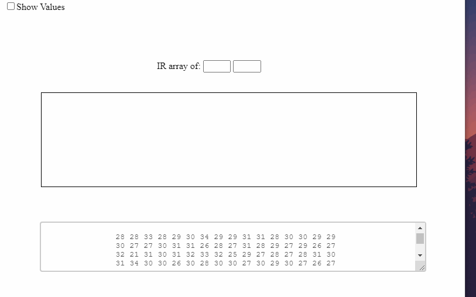

# IR-Thermal-Imaging

- ***Work in progress...***

- **The desktop application aims to facilitate the visualization of Infrared array sensors through the serial port.**

- ## To Use

``` 
# Clone this repository 
git clone https://github.com/brenogsantos/IR-Thermal-Imaging.git
# Go into the repository
cd IR-Thermal-Imaging
# Install dependencies
npm install
# Run the app
npm start
```

- ***The standar port is COM4, you might need to change it in windows.js, still working on it...***
- ***The serial output needs to be just like the next example:***

- Example; exposing the sensor to heat and cold:


